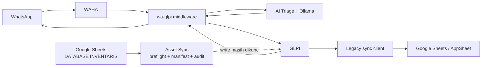

# Resume Status Project IT Helpdesk

**Tanggal snapshot:** 26 Agustus 2026 (WIB)
**Repository:** `IT-Helpdesk`
**Fokus saat ini:** GLPI, WAHA, AI Triage, dan Asset Sync
**Status umum:** Implementasi utama tersedia, tes otomatis hijau, dan middleware terbaru sudah aktif di Development Server. Operasional WhatsApp masih menunggu scan QR WAHA; AI Triage server belum dipasang atau diaktifkan.

> Dokumen ini tidak memuat token, password, API key, atau isi service-account. Konfigurasi rahasia tetap harus disimpan di `.env` atau secret volume lokal.

## 1. Ringkasan Eksekutif

Project memiliki tiga jalur integrasi yang berbeda:

1. **WhatsApp → GLPI → WhatsApp**, dengan middleware WAHA dan AI triage lokal.
2. **Google Sheets `DATABASE INVENTARIS` → GLPI**, melalui service `asset-sync` yang saat ini masih dikunci dalam mode aman/dry-run.
3. **GLPI → Google Sheets/AppSheet**, melalui client lama di root repository yang kodenya sudah tersedia tetapi masih membutuhkan konfigurasi dan validasi integrasi terbaru.



## 2. Status Per Komponen

| Komponen | Status source | Status runtime | Keterangan |
| --- | --- | --- | --- |
| GLPI lokal + MariaDB | ✅ Tersedia | ✅ Berjalan | GLPI di `localhost:8080`; database internal |
| WAHA lokal | ✅ Tersedia | ✅ Berjalan | Dashboard/API di `localhost:3001` |
| Middleware WAHA ↔ GLPI | ✅ Diimplementasikan | ⚠️ Aktif di server | Source terbaru aktif; alur chat menunggu WAHA terhubung |
| AI Triage FastAPI | ✅ Phase 1 diimplementasikan | ⏸️ Belum aktif di server | Internal-only; deployment server masih diperlukan |
| Ollama | ✅ Terkonfigurasi | ✅ Berjalan dan sehat | Default baru `qwen3:0.6b` |
| Asset Sync Sheets → GLPI | ✅ Engine dan pengaman tersedia | ⏸️ Tidak berjalan | Scheduler/write gate sengaja dinonaktifkan |
| Legacy GLPI → Sheets/AppSheet | ⚙️ Client tersedia | ❓ Belum divalidasi ulang | Membutuhkan credential dan integration test |
| Deployment Development Server | ⚠️ Parsial | ⚠️ Middleware aktif | GLPI sehat; WAHA menunggu QR; AI masih nonaktif |

## 3. Yang Sudah Selesai

### 3.1 Infrastruktur lokal

- GLPI, MariaDB, WAHA, Ollama, AI Triage, dan middleware sudah didefinisikan di [`docker-compose.yml`](docker-compose.yml).
- Container GLPI, database, WAHA, Ollama, AI Triage, dan middleware saat snapshot ini sedang berjalan.
- Port lokal tidak bentrok dengan project CCTV:
  - GLPI: `8080`
  - WAHA: `3001`
  - AI Triage: internal Compose saja
  - Ollama: internal Compose saja
- State penting middleware dan AI diarahkan ke volume persisten.
- Template konfigurasi tersedia di [`.env.example`](.env.example).

### 3.2 Middleware WhatsApp ↔ GLPI

Implementasi utama berada di [`wa-glpi/app.py`](wa-glpi/app.py).

- Membaca pesan masuk WhatsApp dari WAHA.
- Membuat tiket GLPI dan mengirim nomor tiket ke pengguna.
- Menambahkan pesan selanjutnya sebagai follow-up pada tiket aktif.
- Mengirim follow-up publik GLPI kembali ke WhatsApp.
- Mengabaikan pesan `fromMe`, inbound follow-up yang memiliki marker WAHA, dan private note GLPI agar tidak terpantul ke pengguna.
- Melakukan deduplikasi berbasis message ID, baik ketika AI aktif maupun tidak.
- Menyimpan conversation state, retry state, acknowledgment, dan outbound reply state di SQLite.
- Menggunakan TTL percakapan; setelah TTL habis, laporan baru tidak dipaksa masuk ke tiket lama.
- Menambahkan marker stabil pada tiket/follow-up GLPI untuk recovery setelah timeout atau crash.
- Memvalidasi HTTP status, response ticket/follow-up ID, dan menggunakan timeout jaringan.
- Membuka session GLPI hanya setelah deduplikasi dan menutup session melalui `killSession`.
- Memakai template WhatsApp allowlist; teks bebas dari model tidak pernah diteruskan langsung.
- Menjaga kompatibilitas server dengan tetap mempertahankan lokasi dan fungsi utama `wa-glpi/app.py`.

File pendukung:

- [`wa-glpi/ai_client.py`](wa-glpi/ai_client.py): client internal menuju AI Triage.
- [`wa-glpi/state_manager.py`](wa-glpi/state_manager.py): SQLite state, dedupe, TTL, dan retry.
- [`wa-glpi/tests/test_workflow.py`](wa-glpi/tests/test_workflow.py): pengujian workflow middleware.

### 3.3 AI Triage Phase 1

Service berada di [`ai-triage/`](ai-triage/).

- FastAPI endpoint `POST /api/v1/triage` dan health endpoint internal sudah tersedia.
- Menggunakan pendekatan **hybrid advisory**:
  - masalah umum yang eksplisit dirutekan secara cepat oleh rule lokal;
  - jawaban pendek atas pertanyaan terakhir memakai conversation state tanpa memanggil model lagi;
  - pesan ambigu diklasifikasikan Ollama menggunakan satu route code allowlist.
- Default model diubah ke `qwen3:0.6b` agar lebih realistis untuk CPU lokal.
- Output Ollama dibatasi dan divalidasi dengan schema ketat.
- Hasil model-only compact menggunakan confidence konservatif di bawah threshold default sehingga memerlukan human review.
- Rule insiden kritis seperti ransomware, phishing, kebocoran data, atau dampak bisnis besar dijalankan sebelum ketergantungan pada model.
- Password, OTP, dan token disensor sebelum pesan dikirim ke Ollama.
- Pertanyaan klarifikasi berasal dari template Bahasa Indonesia milik server.
- Conversation state menggabungkan asset ID, site, gejala, jenis koneksi, affected scope, affected service, dan business impact.
- Audit SQLite hanya menyimpan hash conversation/message dan metadata prediksi, bukan isi pesan mentah.
- Jika Ollama atau AI service gagal, middleware tetap membuat tiket melalui fail-open fallback.
- AI hanya menambahkan metadata/catatan advisory; tidak melakukan auto-close dan tidak menimpa field native GLPI.

Dokumentasi teknis tersedia di [`ai-triage/README.md`](ai-triage/README.md).

### 3.4 Asset Sync Google Sheets → GLPI

Service berada di [`asset-sync/`](asset-sync/) dan dokumentasi lengkap berada di [`asset-sync/README.md`](asset-sync/README.md).

- Sumber resmi dikunci ke Google Sheets tab `DATABASE INVENTARIS`.
- `Registration Asset` Excel hanya diperbolehkan sebagai bahan perbandingan manual dan tidak masuk runtime sync.
- Scope runtime dikunci ke itemtype `Computer` untuk baris Elektronik CPU/Laptop.
- `QRCODE UNIT` dipetakan secara exact ke `otherserial` GLPI; tidak ada fallback berdasarkan nama.
- Snapshot header dan data A:Z diambil secara atomik.
- Header hilang/duplikat, QR duplikat, collision lintas itemtype/entity, hasil lookup parsial/ambigu, atau error preflight memblokir seluruh batch.
- Semua kandidat dipreflight sebelum mutasi pertama.
- Manifest deterministik beserta SHA-256 tersedia untuk approval satu kali.
- Write melakukan recheck tepat sebelum mutasi untuk mendeteksi stale approval.
- Global mutation lock dan per-QR lock sudah tersedia.
- Empty source cell memakai kebijakan `preserve_glpi`, sehingga data GLPI tidak dikosongkan tanpa mekanisme eksplisit.
- Audit SQLite, private manifest, dan laporan read-only sudah tersedia.
- Direct endpoint `POST /api/v1/sync` selalu dry-run dan tidak bisa membuka write.
- Scheduler Minggu pukul 17:00 WIB sudah diimplementasikan tetapi belum dipersenjatai.
- Historical/destructive helper berbasis Registration Asset telah dinonaktifkan dan dilindungi oleh tes kebijakan.
- Docker image, health endpoint, API key middleware, secret staging service-account, dan persistent data volume sudah disiapkan.

### 3.5 Verifikasi otomatis terakhir

| Modul | Hasil |
| --- | ---: |
| Asset Sync | **181 passed** |
| AI Triage | **46 passed** |
| WAHA–GLPI middleware | **16 passed** |
| Total modul yang diverifikasi | **243 passed** |
| Docker Compose config | ✅ Valid |

Catatan warning non-blocking:

- Environment test middleware memakai Python macOS yang terhubung ke LibreSSL lama.
- Environment test Asset Sync masih memakai Python 3.9; library Google menyarankan upgrade minimal ke Python 3.10.

## 4. Yang Belum Selesai

### 4.1 Aktivasi lengkap

- Container lokal `wa_glpi` dan `ai_triage` belum dibuild ulang dari source terakhir.
- Implementasi sudah tercatat dalam commit lokal; commit tersebut belum dipush ke `origin/main` pada snapshot ini.
- Middleware terbaru sudah aktif di Development Server, tetapi feature flag server masih memakai default aman `AI_TRIAGE_ENABLED=false`.
- End-to-end test WhatsApp nyata → WAHA → AI → GLPI → balasan WhatsApp belum dapat dijalankan karena sesi WAHA server masih `SCAN_QR_CODE`.

### 4.2 Konfigurasi GLPI lokal

- Token API GLPI lokal perlu dibuat/diambil dari GLPI lokal dan divalidasi kembali.
- Log pengujian sebelumnya menemukan `ERROR_WRONG_APP_TOKEN_PARAMETER`.
- Token Development Server tidak boleh dipakai di laptop lokal karena token dan encryption key berbeda.
- Tidak ada token yang dicatat di dokumen ini; simpan hanya di `.env` lokal.

### 4.3 AI Triage lanjutan

- Polling WAHA masih hanya membaca satu `lastMessage` per chat. Beberapa pesan yang datang sangat cepat di antara dua polling masih berisiko tidak terbaca.
- Webhook atau ingestion message-history dengan cursor belum dibuat.
- Mapping AI ke field native GLPI—category, priority, group, dan assignee—belum diaktifkan dan membutuhkan mapping yang disetujui helpdesk.
- AI belum boleh menutup tiket, menyatakan masalah selesai, atau mengirim solusi bebas.
- Dataset evaluasi nyata, confusion matrix, target akurasi, dan regression benchmark Bahasa Indonesia belum dibuat.
- RAG/knowledge base untuk menyarankan solusi dikenal masih menjadi Phase 2.
- Latency dan kualitas `qwen3:0.6b` perlu diuji lagi dengan contoh tiket produksi yang sudah dianonimkan.
- Filter author/source GLPI perlu divalidasi terhadap payload GLPI produksi; saat ini marker inbound dan private note sudah difilter.

### 4.4 Asset Sync pilot dan production readiness

Konfigurasi aktif masih sengaja mengunci seluruh write:

```ini
SYNC_ENABLED=false
SYNC_DRY_RUN=true
SYNC_FINANCE_ENABLED=false
SYNC_ALLOW_CREATE=false
SYNC_ALLOW_INFOCOM_CREATE=false
SYNC_ALLOW_INFOCOM_UPDATE=false
SYNC_MAX_GLPI_MUTATIONS_PER_RUN=0
```

Pekerjaan yang belum dilakukan:

- Container Asset Sync belum dijalankan pada snapshot ini.
- Credential Google service-account, akses spreadsheet, entity GLPI, dan API token target perlu diverifikasi end-to-end.
- Dry-run terhadap snapshot Datasheet terbaru perlu dijalankan dan manifest-nya ditinjau manual.
- Pilot write lokal belum dapat dibuka melalui endpoint HTTP biasa karena jalur write mensyaratkan HTTPS dan TLS verification.
- Perlu endpoint HTTPS lokal atau keputusan policy transport yang eksplisit sebelum pilot write.
- Create asset, update asset, Infocom create/update, dan finance sync masih dikarantina.
- GLPI perlu aturan uniqueness untuk `otherserial`/QR dan nomor DAT sebelum create dibuka.
- Service account harus mempunyai read recursive pada seluruh scope identitas dan write minimum pada entity target.
- Pilot pertama harus memakai mutation cap kecil, approval hash sekali pakai, backup, dan observasi manual.
- Scheduler tidak boleh diaktifkan sebelum pilot manual berhasil.
- Image release masih perlu tag immutable dan build commit nyata, bukan `local`/`unknown`.
- Deployment dan operational runbook di Development Server belum diselesaikan.

### 4.5 Legacy GLPI → Sheets/AppSheet

- Client root untuk GLPI, Google Sheets, dan AppSheet sudah tersedia, tetapi belum diuji ulang pada siklus kerja terbaru.
- Credential, Spreadsheet ID, AppSheet App ID/access key, dan target table tetap perlu dikonfigurasi.
- Perlu keputusan arsitektur apakah jalur lama ini tetap dipertahankan, dibatasi read-only, atau digantikan oleh workflow Asset Sync yang lebih ketat.
- Belum ada hasil integration test terbaru yang membuktikan write ke Google Sheets/AppSheet target.

### 4.6 Deployment server

- `wa-glpi/app.py`, `state_manager.py`, `ai_client.py`, dan `requirements.txt` terbaru sudah dipasang di Development Server.
- Service `wa-glpi.service` aktif tanpa restart loop; autentikasi API GLPI berhasil.
- State SQLite berhasil dibuat dengan mode file `600`; mapping tiket, cursor follow-up, dan `.env` lama tidak berubah.
- Backup pra-deploy tersedia di `/home/glpiusr/wa-glpi/backups/20260826-232459-3bdccc5`.
- Sesi WAHA `default` masih `SCAN_QR_CODE`, sehingga polling chat belum operasional.
- Ollama, model `qwen3:0.6b`, dan service AI Triage belum dipasang atau diaktifkan di server.
- Struktur `wa-glpi/` harus tetap kompatibel dengan `/home/glpiusr/wa-glpi/` di server.
- `wa-glpi/app.py` dan fungsi kuncinya tidak boleh dipindah atau diganti nama.
- Token lokal dan token server harus tetap dipisahkan.

## 5. Risiko dan Batasan Saat Ini

| Prioritas | Risiko/batasan | Mitigasi saat ini |
| --- | --- | --- |
| Tinggi | WAHA server belum tertaut ke WhatsApp | Scan QR untuk session `default`, lalu jalankan smoke test |
| Tinggi | AI Triage belum aktif di Development Server | Deploy Ollama + sidecar secara terpisah setelah WAHA sehat |
| Tinggi | Token GLPI lokal belum valid | Regenerasi token dari GLPI lokal |
| Tinggi | Burst WhatsApp dapat terlewat karena `lastMessage` polling | Rencanakan webhook/history cursor |
| Tinggi | Asset write belum pernah dipilotkan | Semua gate default tertutup dan cap `0` |
| Sedang | Model kecil dapat salah klasifikasi pesan ambigu | Confidence konservatif + human review |
| Sedang | AI metadata belum menjadi routing native GLPI | Tetap advisory sampai mapping disetujui |
| Sedang | Runtime Python test lama | Upgrade environment lokal ke Python 3.10/3.11 |
| Sedang | Writer eksternal GLPI tidak mengikuti file lock Asset Sync | Tambahkan uniqueness constraint di GLPI |

## 6. Checklist Pengujian Berikutnya

### 6.1 AI Triage dan middleware

- [ ] Buat/validasi App Token dan User Token pada GLPI lokal.
- [ ] Tambahkan `AI_TRIAGE_ENABLED=true` ke `.env` untuk sesi pengujian.
- [ ] Pastikan `OLLAMA_MODEL=qwen3:0.6b` dan `OLLAMA_COMPACT_MODE=true`.
- [ ] Rebuild dan recreate service terbaru:

  ```bash
  docker compose up -d --build ollama ai-triage wa-glpi
  ```

- [ ] Periksa health AI dan log middleware.
- [ ] Uji `Halo` → tidak membuat tiket baru.
- [ ] Uji `Printer QR AST-1042 tidak bisa mencetak, kertas macet` → kategori printer/paper jam dan meminta site.
- [ ] Balas `Jakarta` → memperbarui tiket yang sama tanpa model call baru.
- [ ] Uji `Ada ransomware di laptop` → critical dan human review.
- [ ] Uji pesan ambigu → tiket tetap dibuat dan ditandai human review.
- [ ] Ulangi message ID yang sama → tidak ada tiket/follow-up duplikat.
- [ ] Tambahkan follow-up publik dan private note di GLPI → hanya follow-up publik yang dikirim ke WhatsApp.
- [ ] Restart container di tengah workflow → state, mapping, dan dedupe tetap bertahan.

### 6.2 Asset Sync dry-run

- [ ] Verifikasi permission service-account dan akses ke spreadsheet target.
- [ ] Verifikasi GLPI URL, entity, TLS, dan token target.
- [ ] Jalankan container Asset Sync dengan semua write gate tetap tertutup.
- [ ] Pastikan health menyatakan database dan GLPI connectivity sehat.
- [ ] Jalankan laporan Datasheet read-only.
- [ ] Jalankan batch dry-run dan tinjau summary, audit, serta manifest privat.
- [ ] Selesaikan seluruh source duplicate, lookup ambiguity, collision, dan preflight error.
- [ ] Jangan membuka create/finance/scheduler sebelum checklist pilot write disetujui.

## 7. Urutan Prioritas Rekomendasi

1. **Scan QR WAHA server untuk session `default`.**
2. **Jalankan end-to-end WhatsApp → GLPI → WhatsApp pada middleware yang sudah aktif.**
3. **Deploy Ollama dan AI Triage secara terpisah, lalu aktifkan feature flag server.**
4. **Jalankan end-to-end AI Triage dan evaluasi contoh tiket yang sudah dianonimkan.**
5. **Push commit lokal ke Git remote setelah tujuan push dikonfirmasi.**
6. **Jalankan Asset Sync dalam dry-run dan review manifest.**
7. **Siapkan HTTPS, uniqueness rule, backup, dan mutation cap untuk pilot Asset Sync.**
8. **Baru lanjutkan webhook WAHA, native GLPI routing, dan RAG sebagai fase berikutnya.**

## 8. Catatan Working Tree

- Implementasi AI Triage dan middleware sudah masuk commit lokal, dan middleware dari snapshot tersebut sudah dipasang di Development Server.
- Commit lokal belum dipush ke `origin` GitHub karena tujuan push eksternal belum dikonfirmasi secara eksplisit.
- Dua file Excel `Registration Asset` di folder `docs/` belum dilacak Git dan tetap hanya menjadi referensi perbandingan manual.
- File Excel tersebut tidak boleh dijadikan sumber runtime Asset Sync.
- `.env`, database SQLite, manifest privat, laporan privat, dan credential tidak ikut ke commit implementasi.

## 9. Referensi Internal

- [README utama](README.md)
- [Struktur project](PROJECT_STRUCTURE.md)
- [Ringkasan setup lokal](SETUP_SUMMARY.md)
- [Dokumentasi AI Triage](ai-triage/README.md)
- [Dokumentasi Asset Sync](asset-sync/README.md)
- [Konfigurasi Compose](docker-compose.yml)
