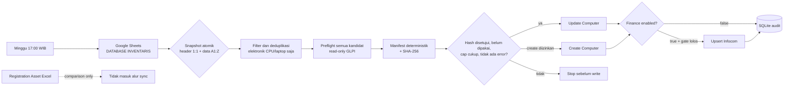

# Asset Sync: Google Sheets ke GLPI

Service ini melakukan sinkronisasi satu arah dari tab Google Sheets **`DATABASE INVENTARIS`** ke GLPI. Nilai `QRCODE UNIT` menjadi identitas aset dan dipetakan ke `otherserial` di GLPI.

`Registration Asset` Excel hanya boleh dipakai sebagai bahan perbandingan manual. File tersebut tidak dibaca oleh service dan tidak boleh menjadi sumber pembuatan atau pembaruan aset.

## Alur



Pencarian aset tidak pernah fallback ke nama. Nama hanya atribut deskriptif yang disusun dari subkategori, merk, dan tipe. Nilai dropdown Datasheet wajib memiliki satu exact match di GLPI; nilai yang tidak ditemukan, ambigu, atau hanya muncul dalam hasil parsial menghentikan preflight batch.

## Pengaman bawaan

- `SYNC_ENABLED=false`: job mingguan belum dipersenjatai.
- `SYNC_DRY_RUN=true`: hanya membaca Google Sheets/GLPI dan menulis audit lokal; tidak membuat atau mengubah data GLPI.
- `SYNC_FINANCE_ENABLED=false`: batch hanya memetakan aset; DAT, tanggal, nilai, penyusutan, lookup Infocom/DAT, dan gate Infocom dikarantina.
- `POST /api/v1/sync` selalu dry-run dan tidak memiliki konfigurasi untuk membuka write.
- `SYNC_ALLOW_CREATE=false`: kandidat baru tidak boleh dibuat sampai izin create dibuka secara terpisah.
- `SYNC_ALLOW_INFOCOM_CREATE=false`: update aset tidak boleh diam-diam membuat record keuangan baru.
- `SYNC_ALLOW_INFOCOM_UPDATE=false`: record Infocom yang sudah ada juga tidak boleh diubah tanpa izin terpisah.
- `SYNC_MAX_GLPI_MUTATIONS_PER_RUN=0`: nol berarti semua write diblokir, bukan tanpa batas.
- `SYNC_APPROVED_MANIFEST_SHA256=`: batch write harus cocok dengan satu manifest yang ditinjau dan approval-nya hanya dapat dipakai sekali.
- Scope batch dikunci ke `SYNC_ASSET_TYPES=["Computer"]` dengan selector `electronics_cpu_laptop_v1`: hanya baris Elektronik CPU/Laptop yang menjadi itemtype `Computer`. Nilai scope lain membuat service gagal start; baris Monitor dicatat sebagai `scope_excluded` dan tidak pernah dipreflight atau dimutasi.
- Header yang hilang/duplikat, QR sumber duplikat, atau satu saja error preflight memblokir seluruh batch write.
- Semua kandidat dipreflight sebelum mutasi pertama; GLPI diperiksa kembali tepat sebelum setiap write untuk menangkap perubahan setelah approval.
- QR dicari secara exact pada `Computer` dan `Monitor` di scope entity rekursif yang dapat diakses. Match kemudian diverifikasi lewat full item GLPI; collision lintas tipe/entity menghasilkan error dan tidak dimutasi.
- Match hanya boleh berada di `GLPI_ENTITY`; update tidak mengirim ulang entity sehingga aset tidak dipindahkan diam-diam.
- Cell atribut Datasheet yang kosong memakai kebijakan `preserve_glpi`: field GLPI yang sudah berisi tidak dikosongkan otomatis. Kebijakan ini ikut diikat ke hash manifest; penghapusan nilai memerlukan mekanisme eksplisit terpisah agar blank yang tidak sengaja tidak merusak data.
- Recheck dan write memakai global OS mutation lock lalu per-QR lock (urutan tetap) di `SYNC_LOCK_DIR`. Global lock mencegah dua QR berbeda mengambil DAT yang sama secara bersamaan; semua worker lokal harus berbagi data volume tersebut. Perubahan client GLPI eksternal yang sudah terjadi sebelum recheck akan tertangkap, tetapi writer eksternal tidak tunduk pada file lock lokal.
- TLS GLPI diverifikasi secara default.
- Batch write hanya diizinkan bila `GLPI_URL` memakai HTTPS dan `GLPI_VERIFY_TLS=true`; HTTP tetap dapat dipakai untuk dry-run lokal.
- Laporan selalu memvalidasi nilai keuangan. Ketika finance batch diaktifkan, tanggal, nilai Rupiah, dan penyusutan yang tidak valid memblokir preflight; nilai harus finite/nonnegatif dan penyusutan harus berupa bilangan bulat tahun yang positif.
- Ketika finance batch diaktifkan, duplikasi nomor DAT nonkosong pada kandidat QR unik memblokir seluruh batch. Setiap DAT juga dicari exact melalui search option GLPI 11 `12` pada scope recursive yang terlihat, lalu detail pemiliknya diverifikasi; DAT milik aset lain atau hasil parsial/ambigu memblokir preflight. Ringkasan hanya menyimpan jumlah konflik, bukan nilai DAT konfliknya.
- POST create tidak di-retry otomatis karena respons yang hilang dapat menyebabkan aset ganda.
- Audit baru tidak menyimpan payload Datasheet mentah: hanya daftar nama field dan SHA-256 canonical. Response dan error juga dibatasi ke metadata operasional.

Jangan membuka beberapa gate write sekaligus pada deployment pertama. Jalankan dan tinjau dry-run lebih dahulu.

## Konfigurasi

Salin contoh konfigurasi, lalu isi secret secara lokal:

```bash
cp .env.example .env
chmod 600 .env
chmod 600 data/service_account.json
```

Jangan simpan service-account Google di `.env`. Compose membaca
`data/service_account.json` sebagai secret sumber. Init container tanpa network
memvalidasi bentuk JSON, lalu menyalinnya secara atomik ke volume terpisah
sebagai UID/GID `10001` dengan mode `0400`. Aplikasi memasang volume tersebut
read-only dan gagal start jika owner atau modenya berubah. Init container hanya
mendapat capability `CHOWN` dan `DAC_READ_SEARCH`; capability kedua diperlukan
di Linux untuk membaca secret bind-mount `0600` yang tetap dimiliki UID host.

Konfigurasi utama:

```ini
GLPI_URL=http://host-yang-dapat-diakses-container/apirest.php
GLPI_ENTITY=0
GLPI_VERIFY_TLS=true
SHEET_NAME=DATABASE INVENTARIS
SYNC_ASSET_TYPES=["Computer"]

SYNC_ENABLED=false
SYNC_DRY_RUN=true
SYNC_FINANCE_ENABLED=false
SYNC_ALLOW_CREATE=false
SYNC_ALLOW_INFOCOM_CREATE=false
SYNC_ALLOW_INFOCOM_UPDATE=false
SYNC_MAX_GLPI_MUTATIONS_PER_RUN=0
SYNC_APPROVED_MANIFEST_SHA256=
SYNC_MANIFEST_DIR=./data/manifests
SYNC_LOCK_DIR=./data/locks
SYNC_DAY_OF_WEEK=sun
SYNC_HOUR=17
SYNC_MINUTE=0
SYNC_TIMEZONE=Asia/Jakarta
ASSET_SYNC_IMAGE_TAG=1.1.0-local
ASSET_SYNC_PLATFORM=linux/amd64
ASSET_SYNC_BUILD_COMMIT=unknown
```

Untuk HTTPS dengan CA internal, pasang CA yang benar ke container. Jangan menonaktifkan verifikasi TLS sebagai solusi permanen.

Untuk tujuan saat ini—memasukkan Computer ke GLPI lokal MacBook—gunakan `GLPI_URL=http://host.docker.internal:8080/apirest.php`. HTTP lokal boleh untuk dry-run; jalur write tetap menuntut HTTPS, sehingga pilot write lokal belum dapat dibuka sebelum endpoint lokal diberi TLS atau policy transport lokal dirancang secara eksplisit.

Pada server `192.168.1.189`, gunakan `GLPI_URL=https://glpi.samator.com/apirest.php`. Compose memetakan hostname yang cocok dengan sertifikat tersebut ke host gateway, sehingga koneksi tetap lokal tanpa mengorbankan verifikasi TLS.

Jaminan collision QR/DAT hanya mencakup entity yang dapat dilihat secara recursive oleh akun API. Akun service harus memiliki akses baca recursive ke seluruh scope identitas dan write minimum hanya ke entity target. Writer GLPI di luar service tidak ikut file lock lokal; aktifkan juga aturan field uniqueness GLPI untuk `otherserial` dan nomor DAT sebelum membuka create.

## Menjalankan service

```bash
docker compose up -d --build
curl --fail --silent http://localhost:8555/health | jq -e \
  '.status == "ok" and .database_connectivity and .glpi_connectivity'
```

Port host hanya bind ke `127.0.0.1:8555`; port internal container adalah `8000`. Image hanya menyalin kode runtime. `.env`, service-account Google, database audit, spreadsheet, test, dan helper script tidak dimasukkan ke image layer. Compose menyalin service-account ke named volume `asset-sync-credentials` melalui init container, lalu memasangnya read-only pada service. Audit, manifest, serta lock tersimpan terpisah di named volume `asset-sync-data`.

Target image default adalah `linux/amd64`, sama dengan server Ubuntu. Sebelum membuat artefak release, ganti `ASSET_SYNC_IMAGE_TAG` menjadi tag immutable seperti `1.1.0-7c2cbeaffe14` dan isi `ASSET_SYNC_BUILD_COMMIT` dengan commit yang sama. Compose meneruskannya ke label OCI image; jangan deploy tag `latest`, `1.1.0-local`, atau revision `unknown`.

Untuk rotasi service-account, jangan menimpa file saat service masih berjalan.
Hentikan service, ganti file sumber dengan mode `0600`, lalu jalankan Compose
kembali. Dependency `service_completed_successfully` memastikan aplikasi baru
hanya dimulai setelah staging credential baru berhasil:

```bash
docker compose stop asset-sync
chmod 600 data/service_account.json
docker compose up -d --build --force-recreate asset-sync-credentials-init asset-sync
```

Pemeriksaan berikut hanya membaca metadata file, bukan isi credential:

```bash
docker compose exec asset-sync python -c \
  'import os,stat; p="/app/secrets/google-service-account.json"; s=os.stat(p); assert (s.st_uid,s.st_gid,stat.S_IMODE(s.st_mode)) == (10001,10001,0o400)'
```

Response health versi 1.1.0 juga menampilkan kondisi gate:

```json
{
  "status": "ok",
  "version": "1.1.0",
  "database_connectivity": true,
  "glpi_connectivity": true,
  "sync_enabled": false,
  "sync_dry_run": true,
  "sync_asset_types": ["Computer"],
  "sync_datasheet_scope_selector": "electronics_cpu_laptop_v1",
  "sync_finance_enabled": false,
  "sync_allow_create": false,
  "sync_allow_infocom_create": false,
  "sync_allow_infocom_update": false,
  "sync_max_glpi_mutations_per_run": 0
}
```

## API satu aset

`POST /api/v1/sync` membutuhkan header `X-API-KEY`.

```json
{
  "qrcode": "SMTR-IT-000123",
  "asset_type": "Computer",
  "name": "Laptop Dell Latitude",
  "brand": "Dell",
  "model": "Latitude",
  "location": "Pusat > Jakarta > HO",
  "user": "Pengguna A"
}
```

Responsnya selalu read-only (`would_create`, `would_update`, atau `unchanged`) dengan `dry_run: true`. Nilai `SYNC_DRY_RUN` tidak dapat mengubah endpoint ini menjadi jalur write; mutasi hanya tersedia melalui batch Datasheet dengan manifest yang ditinjau. Request langsung yang menyertakan field finance tetap divalidasi meskipun finance batch sedang dikarantina.

Field CPU, RAM, storage, OS, MAC, dan monitor-link sengaja tidak diterima. Datasheet A:Z saat ini tidak menyediakan field tersebut, dan GLPI membutuhkan pemetaan native yang terpisah.

## Jadwal

Job memakai `CronTrigger`, timezone `Asia/Jakarta`, `coalesce=true`, dan maksimal satu instance. Konfigurasi default menjalankan job setiap Minggu pukul 17:00 WIB setelah `SYNC_ENABLED=true`.

Job yang terlewat ketika container mati tidak otomatis diputar ulang. Jalankan hanya satu replica/worker scheduler agar satu batch tidak dieksekusi ganda.

## Approval manifest batch

Preflight menyimpan manifest privat di `SYNC_MANIFEST_DIR`. Hash selalu mencakup satu snapshot atomik header+seluruh data A:Z—termasuk baris di luar scope dan cell finance mentah saat finance dinonaktifkan—serta entity, policy `asset_types=["Computer"]`, selector `electronics_cpu_laptop_v1`, hasil pencarian GLPI, payload, pemilihan deterministik, dan biaya mutasi. Manifest juga terikat ke URL target GLPI yang sudah dikanonisasi serta SHA-256 Spreadsheet ID; ID spreadsheet mentah tidak ditulis. Karena itu approval staging tidak dapat dipakai setelah endpoint, sumber spreadsheet, atau policy scope diganti. Timestamp tidak memengaruhi hash.

Ringkasan dry-run memisahkan mode dari kesiapan: `approval_status` menjadi `dry_run_ready`, `dry_run_no_changes`, atau `dry_run_blocked`, sedangkan `readiness_status` menyebut penyebab seperti `source_duplicates`, `preflight_errors`, atau `policy_blocked`. Plan yang terblokir tetap terlihat sebagai `would_create`/`would_update`, tetapi auditnya berstatus `BLOCKED`, bukan sukses.

Alur approval:

1. Biarkan `SYNC_DRY_RUN=true`, atur mutation cap yang ingin ditinjau, lalu jalankan preflight.
2. Tinjau manifest JSON privat; jangan menyalinnya ke chat karena payload dapat berisi data pengguna.
3. Isi hash yang persis sama ke `SYNC_APPROVED_MANIFEST_SHA256`, lalu ubah `SYNC_DRY_RUN=false` hanya untuk eksekusi terkontrol.
4. Sebelum write pertama, hash diklaim atomik. Hash yang sama tidak dapat dipakai lagi, termasuk setelah crash/partial failure.
5. Setelah selesai, kosongkan approval dan kembalikan `SYNC_DRY_RUN=true`.

Plan dibuat dari diff terhadap full record GLPI. Field yang sudah sama tidak dikirim ulang; aset dan Infocom yang seluruh targetnya sama menjadi `NOOP`, berbiaya nol, dan tidak pernah dipilih untuk write. Saat `SYNC_FINANCE_ENABLED=false`, request batch tidak membawa field finance sehingga tidak ada lookup, plan, gate, atau mutasi Infocom/DAT. Saat gate itu dibuka, seluruh validasi dan pengaman finance kembali berlaku. Satu create/update aset dihitung satu mutasi; create/update Infocom menambah satu mutasi. Batch memilih item secara deterministik tanpa pernah melewati cap. Snapshot seluruh field target disimpan sebagai fingerprint dalam manifest dan dibandingkan kembali tepat sebelum write; perubahan field dengan ID yang sama membuat approval stale.

## Laporan Datasheet read-only

Laporan sumber dapat dibuat tanpa membuka GLPI:

```bash
./venv/bin/python scripts/generate_datasheet_report.py
```

Generator mengambil header penuh `1:1` dan data `A1:Z` dalam satu `batchGet`, lalu menolak drift di antara keduanya. Scope laporan juga dikunci ke Computer CPU/Laptop; Monitor—termasuk Monitor tanpa QR—hanya masuk agregat `scope_excluded` dan tidak memengaruhi gate duplikasi atau finance Computer. Laporan tetap menjalankan mapping finance untuk Computer agar masalah DAT/tanggal/nilai/penyusutan terlihat walaupun runtime finance dimatikan. Hasil lokal berada di `data/reports/<timestamp>/` sebagai `summary.md`, `summary.json`, dan `details.json`; direktori bermode `0700`, file `0600`. Nilai konflik, DAT mentah, dan PII tidak ditulis. `details.json` hanya memuat QR, nomor baris, dan kode error aman. Registration Asset Excel tidak pernah dibaca.

## Tes

```bash
./venv/bin/python -m pip install -r requirements-dev.txt
PYTHONDONTWRITEBYTECODE=1 ./venv/bin/pytest -p no:cacheprovider -q
```

Konfigurasi `pytest.ini` membatasi discovery ke folder `tests/`, sehingga script manual yang dapat menyentuh GLPI nyata tidak ikut dijalankan.
