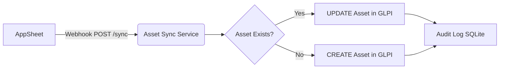

# Asset Management Synchronization (AppSheet to GLPI)

This project is a one-way synchronization service that listens for updates from Google AppSheet via a webhook and pushes them into GLPI. 
AppSheet is the **Source of Truth**, and GLPI acts as the **Asset Consumer and Helpdesk**.

## Flow Diagram



## Features
- **One-Way Sync:** Changes only flow from AppSheet to GLPI.
- **Unique Identifier:** Uses `QRCODE_UNIT` as the immutable primary key (mapped to `otherserial` in GLPI).
- **Duplicate Protection:** Checks if an asset exists before creating.
- **Resilience:** Uses exponential backoff for GLPI API calls.
- **Audit Logging:** Logs all sync attempts (success/failure) in an SQLite database.
- **Security:** Requires an API key in the `X-API-KEY` header.

## Installation

### 1. Environment Configuration
Copy `.env.example` to `.env` and fill in the details:
```bash
cp .env.example .env
```
Ensure you generate the `GLPI_APP_TOKEN` and `GLPI_USER_TOKEN` from your GLPI instance.

### 2. Run with Docker Compose
```bash
docker compose up -d --build
```
This will start the FastAPI service on port `8000`.

## API Documentation

### POST `/api/v1/sync`
Synchronizes an asset.

**Headers:**
`X-API-KEY: your_secure_api_key_here`

**Body:**
```json
{
  "qrcode": "SMTR-IT-000123",
  "name": "Laptop Direktur",
  "serial": "ABC123",
  "hostname": "NB-001",
  "location": "HO",
  "user": "Jaka"
}
```

**Response (Success - Updated):**
```json
{
  "status": "updated",
  "glpi_id": 123,
  "message": null
}
```

### GET `/health`
Returns system health.
```json
{
  "status": "ok",
  "version": "1.0.0",
  "database_connectivity": true,
  "glpi_connectivity": true
}
```

## Troubleshooting
- **API Key Error (401):** Ensure your webhook request includes the `X-API-KEY` header matching your `.env` file.
- **GLPI Connection Error:** Check if GLPI is reachable from the docker container. Ensure `GLPI_URL` in `.env` is correct.
- **Logs:** Run `docker logs asset_sync_service` to view detailed application logs. Check the SQLite database `data/audit.db` for full transaction history.
